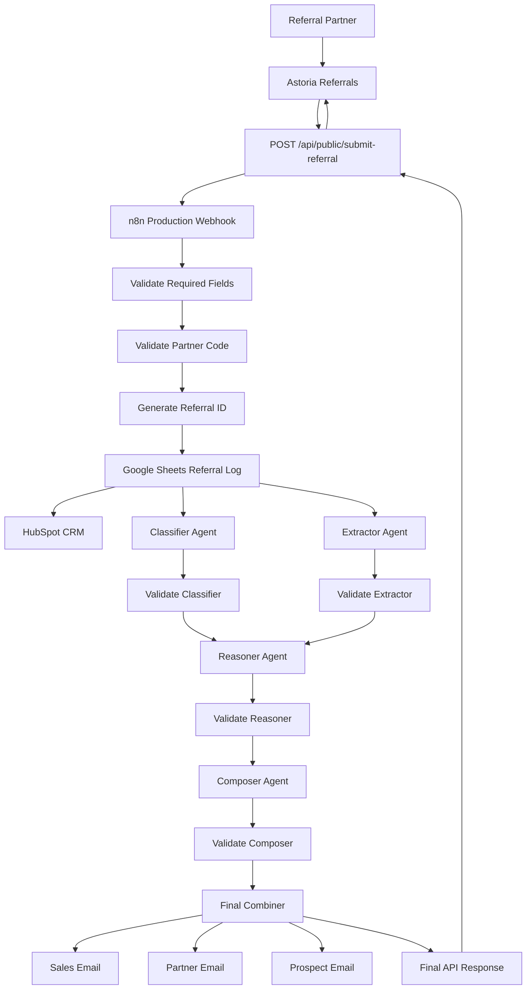
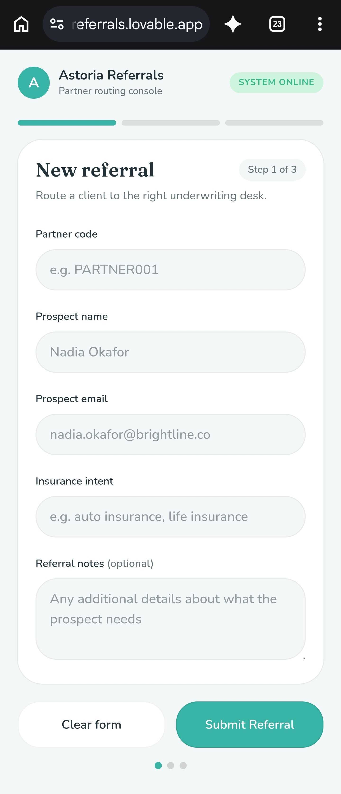

# Astoria Referrals

**Every referral should end with a clear next action.**

*A live referral intake, AI triage, routing, CRM, communication, and observability prototype built through the Gayiti Fellowship.*

[](https://astoria-referrals.lovable.app)
[](https://react.dev/)
[](https://n8n.io/)
[](https://www.anthropic.com/)

---

## 📘 Table of Contents

1. [The Story Behind the Project](#-the-story-behind-the-project)
2. [The Problem](#-the-problem)
3. [What I Built](#-what-i-built)
4. [Live App](#-live-app)
5. [Understanding the Business Flow](#-understanding-the-business-flow)
6. [Architecture](#️-architecture)
7. [The AI Agent Team](#-the-ai-agent-team)
8. [Screenshots](#-screenshots)
9. [Testing & Guardrails](#-testing--guardrails)
10. [Technical Stack](#️-technical-stack)
11. [Running Locally](#-running-locally)
12. [Project Structure](#-project-structure)
13. [Security](#-security)
14. [Observability](#-observability)
15. [Known Limitations](#️-known-limitations)
16. [Next Steps](#-next-steps)
17. [What I Learned](#-what-i-learned)
18. [About This Project](#-about-this-project)

---

## 💭 The Story Behind the Project

This project started much smaller than the app you see today.

In Module 1 of the Gayiti Fellowship, I built a basic n8n workflow that accepted a referral, validated the information, logged it, and sent emails.

Then each module forced a different question.

**Module 2:** What happens when the workflow needs to communicate with real external systems?

**Module 3:** What happens when one prompt is no longer enough and different parts of the decision need different responsibilities?

**Module 4:** What happens when the workflow works technically, but a normal person still cannot actually use it?

**Module 5:** Can I test, document, and hand the system to someone else clearly enough that they can understand it without me standing next to them?

**Module 6:** Can I understand what the system is doing when I am not watching it — especially when something breaks?

That progression changed the project from a workflow into a system.

I did not want the final version to be something that only made sense when looking at an n8n canvas. I wanted someone who knows nothing about n8n, APIs, or AI agents to be able to open a link, submit a referral, understand what happened, and trust that failures could be investigated.

That became **Astoria Referrals**.

---

## 🔍 The Problem

A referral sounds simple:

> A partner sends a potential customer to a business.

But there are several decisions hiding behind that simple action:

- Is this a valid referral partner?
- What kind of insurance is the prospect asking for?
- How urgent is the request?
- Which team should handle it?
- How quickly should someone respond?
- Is enough information available to make that decision?
- What happens when the request is vague?
- How does the prospect enter the CRM?
- Who needs to be notified?

Without a system, those decisions can become manual, inconsistent, difficult to trace, or dependent on one person knowing what to do.

The goal of Astoria is **not** to let AI make insurance decisions.

The goal is to use automation and AI to help **organize, triage, route, and communicate around a referral while knowing when a human needs to take over.**

---

## 🚀 What I Built

Astoria Referrals is a live, mobile-friendly web application connected to an organization-managed production n8n workflow.

A referral partner can submit:

- Partner code
- Prospect name
- Prospect email
- Insurance intent
- Optional referral notes

The system then:

1. Validates the submission
2. Confirms the partner code
3. Generates a unique referral ID
4. Logs the referral in Google Sheets
5. Creates or updates the prospect in HubSpot
6. Sends the referral through a four-agent AI team
7. Validates each agent's output
8. Determines routing, priority, SLA, and next action
9. Generates internal and external communication
10. Sends the final result back to the web application
11. Sends the appropriate email notifications
12. Emits sanitized operational telemetry and captures unexpected browser/server failures

The user sees one of three clear outcomes:

- **Ready — routed automatically**
- **Manual review required**
- **A visible validation or connection error**

The system is intentionally designed so that **manual review is a valid business outcome, not a failure state**.

---

## 🌐 Live App

### [Open Astoria Referrals](https://astoria-referrals.lovable.app)

The application is publicly accessible and designed to work on both desktop and mobile.

A referral partner does not need access to n8n or any of the systems running behind the application.

---

## 🤝 Understanding the Business Flow

One thing I had to understand more clearly while building this project was that a **partner**, a **referral**, and a **prospect** are three different things.

```text
PARTNER
Who sends the opportunity
        ↓
REFERRAL
The request moving through the system
        ↓
PROSPECT
The person or business being referred
```

For example:

```text
Partner
PARTNER002
        ↓
submits
        ↓
Referral
REF-2026-182
Auto Insurance
High Priority
4-Hour SLA
        ↓
for
        ↓
Prospect
Daniel Rivera
2024 Honda Accord
```

### Partner

A partner is someone already participating in the referral program.

The current prototype assumes that a partner has already been onboarded and assigned a code such as:

```text
PARTNER001
PARTNER002
PARTNER003
```

The partner does not generate their own code from the referral form.

### Referral

The referral is the request being processed.

Each successful referral receives a unique identifier such as:

```text
REF-2026-182
```

This is the object being triaged and routed by the workflow.

### Prospect

The prospect is the person or business being referred.

The workflow sends prospect information to HubSpot, where the email address is used to create or update the CRM contact.

That lets an existing prospect be updated rather than blindly creating another duplicate contact.

---

## 🏗️ Architecture

The browser does not communicate directly with n8n.

The application sends the form to a server-side route located at:

```text
POST /api/public/submit-referral
```

That server route validates the request again and securely forwards it to the production n8n webhook.

### End-to-End Architecture



### Simplified View

```text
Referral Partner
       ↓
Astoria Referrals
       ↓
Server-side API
       ↓
n8n Workflow
       ↓
Classifier + Extractor
       ↓
Reasoner
       ↓
Composer
       ↓
Final Combiner
       ↓
Result returned to Astoria
```

Supporting systems handle different responsibilities:

```text
Google Sheets        → referral log
HubSpot              → prospect CRM record
Gmail                → communication
n8n                  → workflow orchestration
Claude               → AI reasoning
Astoria              → user experience
Sentry               → browser/server error monitoring
Lovable runtime logs → structured referral telemetry
```

The public browser never calls n8n directly. The server-side API is the boundary that protects the production webhook, adds operational telemetry, and maps upstream failures into safe user-facing responses.

---

## 🤖 The AI Agent Team

Instead of giving one large prompt responsibility for the entire referral, I split the work between four agents.

### 1. Classifier

Answers:

> **What kind of referral is this, and how urgent is it?**

Example:

```text
Insurance Line: Auto
Urgency: High
Confidence: 0.90
```

### 2. Extractor

Answers:

> **What facts were actually provided?**

It is intentionally not responsible for routing the referral.

For an auto referral, it might extract:

```text
Requested Coverage: Full coverage auto insurance
Vehicle: 2024 Honda Accord
Deadline: Friday
Constraint: Dealership requires proof of insurance
```

When information was not provided, the Extractor is expected to leave it missing instead of inventing it.

### 3. Reasoner

Uses the validated Classifier and Extractor outputs to answer:

> **What should happen next?**

It determines:

- Priority
- Routing team
- Response SLA
- Next action
- Whether human review is required

Example:

```text
Priority: High
Route To: Personal Lines
SLA: 4 hours
Human Review: No
```

### 4. Composer

Turns the validated decision into communication for:

- Internal sales team
- Referral partner
- Prospect

The Composer does not get to change the routing decision or make new insurance decisions.

### Final Combiner

The Combiner brings the outputs together into one structured response.

That response becomes the contract between n8n and the web application.

Example:

```json
{
  "referral_id": "REF-2026-182",
  "processing_status": "ready",
  "final_decision": {
    "insurance_line": "auto",
    "urgency": "high",
    "priority": "high",
    "route_to": "personal_lines",
    "sla_hours": 4,
    "needs_human_review": false
  }
}
```

The frontend does not need the entire internal agent trace to display the result.

It maps the backend response into the information the referral partner actually needs.

---

## 📸 Screenshots

### Referral Intake


*The partner-facing form used to submit a referral.*

### Automatically Routed Referral


*A clear referral successfully triaged and routed by the workflow.*

### Manual Review


*An intentionally vague referral is sent to human review instead of forcing the AI to make a decision.*

### Error Handling


*An invalid partner code is rejected while keeping the information already entered on the form.*

### Mobile Experience



*The same referral experience running on a mobile device.*

---

## 🧪 Testing & Guardrails

Before considering the live prototype ready for Demo Day and production-hardening review, I ran a production audit across the system.

| Test | Result |
|---|---|
| Live URL | ✅ PASS |
| Happy path | ✅ PASS |
| Manual review | ✅ PASS |
| Invalid partner error | ✅ PASS |
| Mobile usability | ✅ PASS |
| Browser console | ✅ PASS |
| Google Sheets logging | ✅ PASS |
| HubSpot CRM | ✅ PASS |
| Email delivery | ✅ PASS |
| Automated Vitest suite | ✅ 5/5 PASS |
| Browser Sentry delivery | ✅ PASS |
| Server Sentry delivery | ✅ PASS |
| Structured referral logging | ✅ PASS |
| Request correlation | ✅ PASS |
| Public GitHub | ✅ PASS |
| Privileged secrets exposed | ✅ NO |

### Happy Path

A clear referral should move through the complete system:

```text
Submit
→ Validate
→ Log
→ Update CRM
→ Run AI team
→ Route
→ Send communication
→ Return result
```

A successful production verification produced both `referral.received` and `referral.completed` with the same `request_id`, a `200` status, a referral ID, processing duration, and zero fallbacks.

### Manual Review

If the referral is too vague to route confidently, the system can stop and return:

```text
Manual Review Required
Route: General Review
```

instead of pretending to know more than it does.

The manual-review production test emitted `referral.received` followed by `referral.manual_review` with the same `request_id`, confirming that human review is observable without being treated as an application error.

### Invalid Partner

An unknown partner code is rejected before the referral enters the full workflow.

The user receives a visible error without losing the information they already entered.

### AI Output Validation

Every agent is followed by a validation layer.

If an agent returns:

- Invalid JSON
- Missing output
- An unexpected schema
- An API error

the workflow does not automatically trust it.

A safe fallback can be used and the referral can be escalated for human review.

One of the biggest lessons from building the agent team was:

> **A successful API call does not automatically mean a trustworthy output.**

---

## 🛠️ Technical Stack

### Application

- Lovable
- React 19
- TypeScript
- TanStack Start
- Zod
- Responsive web design

### Workflow

- n8n
- Webhooks
- Structured workflow branching
- Validation and fallback handling

### AI

- Anthropic Claude
- Four-agent orchestration
- Structured JSON outputs

### Integrations

- **HubSpot** — CRM contact creation/update
- **Google Sheets** — referral logging
- **Gmail** — internal, partner, and prospect communication

### Observability

- **Sentry** — browser and server-side error monitoring
- **Structured JSON logs** — referral lifecycle telemetry
- **UUID request IDs** — correlation between lifecycle logs and server error context
- **Sentry dashboard** — error events, unresolved issues, and errors over time

### Testing & Development

- Git
- GitHub
- Vitest
- TypeScript typechecking
- Production build verification
- Runtime environment variables
- Server-side API routes

---

## 💻 Running Locally

Clone the repository:

```bash
git clone https://github.com/Mr-Glucose/referral-partner-app.git
cd referral-partner-app
```

Install dependencies:

```bash
npm install
```

Copy the example environment configuration:

```bash
cp .env.example .env
```

Add the required public project configuration to your local `.env`.

To run the referral flow end-to-end locally, the server also needs access to:

```text
N8N_WEBHOOK_URL
```

This value is private and must remain server-side. It must never be committed to GitHub or exposed through a `VITE_` frontend variable.

For local observability, Astoria can also use:

```text
VITE_SENTRY_DSN   # browser monitoring
SENTRY_DSN        # server-side error delivery
```

The browser-facing Sentry DSN is a public project identifier, not a privileged auth token. `SENTRY_AUTH_TOKEN` is not required for the current setup and is not committed to the repository.

Start the development server:

```bash
npm run dev
```

The application will then be available through the local Vite development server.

---

## 📁 Project Structure

```text
referral-partner-app/
│
├── README.md
├── .env.example
├── .env.production
├── .gitignore
├── package.json
│
├── public/
│
├── src/
│   ├── components/
│   │
│   ├── integrations/
│   │   └── supabase/
│   │
│   ├── lib/
│   │   ├── referral.functions.ts
│   │   ├── referral.functions.test.ts
│   │   ├── sentry.ts
│   │   ├── sentry.server.ts
│   │   └── logger.server.ts
│   │
│   ├── routes/
│   │   ├── api/
│   │   │   └── public/
│   │   │       └── submit-referral.ts
│   │   └── index.tsx
│   │
│   ├── router.tsx
│   └── ...
│
├── supabase/
│   └── config.toml
│
└── docs/
    ├── screenshots/
    │   ├── referral-form.png
    │   ├── referral-success.png
    │   ├── manual-review.png
    │   ├── invalid-partner.png
    │   └── mobile-view.jpg
    │
    └── TECHNICAL_HANDOFF.md
```

### Important Files

- `src/routes/api/public/submit-referral.ts` — server-side boundary between the public app and n8n; handles validation, forwarding, response mapping, structured telemetry, and server-side error capture.
- `src/lib/referral.functions.ts` — frontend service layer used to submit referrals and map API responses into application state.
- `src/lib/referral.functions.test.ts` — automated tests covering validation, successful responses, manual review, and connection failures.
- `src/lib/sentry.ts` — browser-side Sentry initialization and tracing.
- `src/lib/sentry.server.ts` — server-side, edge-compatible Sentry error delivery.
- `src/lib/logger.server.ts` — sanitized structured logging for referral lifecycle events and request correlation.
- `.env.production` — contains only the public browser-facing Sentry DSN required by the frontend monitoring SDK.
- `docs/TECHNICAL_HANDOFF.md` — deeper architecture, deployment, troubleshooting, integration, and extension documentation.

The production n8n workflow and private third-party credentials are intentionally not stored in the frontend repository.

---

## 🔐 Security

The production n8n webhook URL is kept behind a server-side boundary.

```text
Browser
   ↓
/api/public/submit-referral
   ↓
N8N_WEBHOOK_URL
```

The browser never receives the production n8n webhook URL.

Private environment files and privileged credentials are excluded from the public repository.

```text
.env
.env.*
```

The intentional exception is `.env.production`, which is committed because it contains only the public browser-facing `VITE_SENTRY_DSN`. A Sentry browser DSN identifies the destination project for telemetry; it is not an administrative credential.

`.env.example` contains only safe example configuration.

Private values such as `N8N_WEBHOOK_URL`, Anthropic credentials, HubSpot credentials, Google/Gmail credentials, and other privileged runtime configuration remain in their respective backend or secret-management systems.

Astoria does not use or commit a `SENTRY_AUTH_TOKEN` in the current monitoring setup.

---

## Observability

Getting Astoria to work was one problem. Being able to understand what it is doing when I am not watching it was a different one.

During testing, I ran into a real example of that gap. The public app reported that it could not reach the routing service, but the actual failure was deeper in the workflow: a Google Sheets step inside n8n had returned a `Forbidden` error.

Without telemetry, finding the cause meant manually checking systems one by one.

For Module 6, I chose the observability hardening path and added error monitoring, structured referral logs, request correlation, and a simple production-health dashboard.

### Error Monitoring

Astoria uses Sentry for browser and server-side error monitoring.

The server-side monitoring focuses on technical failures around the public referral API, including:

- n8n connection failures
- upstream `5xx` responses
- invalid or empty upstream responses
- missing runtime configuration
- unexpected server exceptions

Expected business outcomes such as invalid input, partner validation errors, and manual review are not treated as application crashes.

### Structured Referral Logs

The referral API emits sanitized structured JSON events for important referral lifecycle states:

- `referral.received`
- `referral.completed`
- `referral.manual_review`
- `referral.upstream_failure`
- `referral.connection_failure`

Each request receives a unique `request_id`, allowing events belonging to the same request to be connected during an investigation.

Operational fields may include:

```text
request_id
referral_id
processing_status
http_status
duration_ms
fallback_count
error_type
```

For example:

```text
referral.received
→ referral.completed
```

or:

```text
referral.received
→ referral.manual_review
```

Manual review is treated as a valid business outcome, not a system failure.

### Monitoring Dashboard

The production monitoring dashboard is available in:

```text
Sentry
→ Astoria Referrals
→ Dashboards
→ Astoria Production Observability
```

The dashboard currently tracks:

| Metric | Meaning |
|---|---|
| **Error Events** | Total technical error events captured by Sentry |
| **Unresolved Issues** | Error types that still require investigation |
| **Errors Over Time** | When technical errors are occurring and whether error activity is increasing |

Structured referral telemetry is available in the Lovable production runtime logs.

Those logs show whether a referral was received, completed, sent to manual review, how long processing took, and whether fallbacks were used.

Together, the two monitoring layers answer different questions:

> **Sentry:** Is Astoria technically breaking?

> **Structured logs:** What happened to this referral?

### Privacy

Observability was intentionally designed to avoid collecting referral content.

Astoria does not send the following information to Sentry or structured logs:

- prospect names
- prospect email addresses
- referral notes
- request bodies
- cookies or authorization headers
- webhook URLs
- API keys or credentials
- email content

Only operational metadata needed to understand system behavior is recorded.

### Twelve-Factor Connection

The Module 6 hardening work reinforced several ideas from the Twelve-Factor App methodology, especially keeping configuration outside application code, treating integrations as backing services, keeping request processing stateless, and treating logs as event streams.

### Current Observability Limitations

The current observability layer focuses on the Astoria web application and its server-to-n8n boundary.

Detailed per-agent latency and deeper n8n node-level telemetry are still investigated through n8n execution history. Source-map uploading to Sentry is also not configured, and the current dashboard focuses on error health rather than long-term business metrics.

A future production version could centralize these signals further and add alerting, service-level objectives, long-term latency metrics, and aggregated human-review/fallback rates.

---

## ⚠️ Known Limitations

This is still a prototype.

### Partner Management

Partner codes are currently predefined in the workflow.

There is no Partner Directory or onboarding interface yet.

The application assumes that a partner has already been onboarded and knows their assigned code.

### Authentication

There is currently no partner login system.

The partner code identifies the referral source, but it is not a complete authentication mechanism.

### Assignment

The workflow currently routes referrals to teams such as:

```text
Personal Lines
Commercial Lines
Life Team
Health Team
General Review
```

It does not assign an individual employee.

### AI Scope

The AI does not:

- Approve insurance coverage
- Determine eligibility
- Set pricing
- Bind policies
- Guarantee certificates
- Replace a licensed professional

Its role is operational triage.

### CRM Scope

HubSpot currently represents the prospect primarily as a CRM contact.

The prototype does not yet contain a complete sales pipeline, deal ownership model, or partner relationship model in HubSpot.

---

## 🚀 Next Steps

At this stage, I am less interested in adding random features and more interested in what would actually make the system usable beyond a prototype.

### 1. Partner Directory

Move partner information out of hardcoded workflow logic and into a real data source.

Example:

| Partner Code | Partner | Email | Status |
|---|---|---|---|
| PARTNER001 | Partner One | partner1@example.com | Active |
| PARTNER002 | Partner Two | partner2@example.com | Active |

n8n could validate the submitted code against this directory.

### 2. Partner Onboarding

Create an internal onboarding flow:

```text
Add Partner
→ Generate Code
→ Store Partner
→ Send Welcome Information
→ Activate Referral Access
```

### 3. Authentication

Allow partners to have accounts rather than relying on a partner code as the primary access mechanism.

### 4. CRM Expansion

Expand HubSpot beyond contact creation/update with:

- Deals
- Referral source
- Pipeline stage
- Referral owner
- Conversion tracking

### 5. Outcome Tracking

The current workflow understands the referral during triage.

A production system should also understand what happened afterward:

```text
Referral Submitted
→ Contacted
→ Quoted
→ Won / Lost
```

### 6. Observability Expansion

The current version already includes browser/server error monitoring, sanitized lifecycle logs, request correlation, and a basic Sentry health dashboard.

Future observability work could add:

- automated alerts for repeated failures
- per-agent and per-node latency
- aggregated human-review rate
- agent fallback-frequency dashboards
- CRM failure metrics
- email delivery failure metrics
- service-level objectives and longer-term performance trends

### 7. Automated Test Coverage

Expand the current application tests into broader frontend, API, integration, and end-to-end coverage.

---

## 💡 What I Learned

One of the biggest lessons from this project was that **building the workflow and understanding the system are not exactly the same thing.**

At first, I was asking:

> Does this node work?

Then:

> Does this API work?

Then:

> Can these agents work together?

Later, the questions became different:

> Who exactly is the partner?

> Where does their partner code come from?

> What does HubSpot represent?

> What happens when there are 100 partners instead of three?

> What should the AI decide, and what should it never decide?

Those questions helped me understand the project as a system instead of only as a collection of working nodes.

Another major lesson was that AI output needs to be treated like any other external input. The fact that a model responded successfully does not mean that the response is complete, valid, or safe to use.

That is why validation, fallbacks, traceability, and human review became part of the architecture instead of afterthoughts.

Module 6 added another lesson: **a system working while I am watching it is not the same as a system I can operate in production.**

When the Google Sheets step failed with a `Forbidden` error, the public app only knew that the routing service had failed. I had to manually inspect n8n to discover the actual cause. That experience changed the question from:

> Does Astoria work?

into:

> If Astoria fails while someone else is using it, can I understand what happened quickly and safely?

Adding error monitoring, structured logs, request correlation, and privacy boundaries made observability part of the product rather than something I would add only after a problem happened.

---

## 🎓 About This Project

**Project:** Astoria Referrals  
**Author:** Arthur Dorvil  
**Program:** Gayiti Fellowship

The project evolved across the fellowship:

```text
Module 1
Referral Intake Automation
        ↓
Module 2
External APIs + Error Handling
        ↓
Module 3
Four-Agent AI Triage Team
        ↓
Module 4
Live Partner-Facing Web App
        ↓
Module 5
Production Polish + Testing + Documentation + Demo Preparation
        ↓
Module 6
Production Hardening + Observability
```

What started as a webhook and a few emails became a complete referral experience connecting a user-facing application, workflow automation, CRM, communication, a multi-agent reasoning layer, automated testing, and production telemetry.

More importantly, I now understand much better **why each layer exists, what responsibility it owns, how I would investigate it when something goes wrong, and where the current prototype stops.**

---

## 🎯 Key Takeaway

> **Every referral should end with a clear next action.**

The goal was never to make AI replace the person handling the referral. The goal was to make sure that person starts with better information, clearer routing, less manual work, and a system that knows when human review is needed.

Astoria Referrals is still a prototype, but it represents the kind of system I want to keep learning how to build:

**practical automation, clear responsibilities, useful AI, observable systems, and humans still in control.**

---

**Live App:** [astoria-referrals.lovable.app](https://astoria-referrals.lovable.app)

**Repository:** [github.com/Mr-Glucose/referral-partner-app](https://github.com/Mr-Glucose/referral-partner-app)

**Built by Arthur Dorvil as part of the Gayiti Fellowship.**
