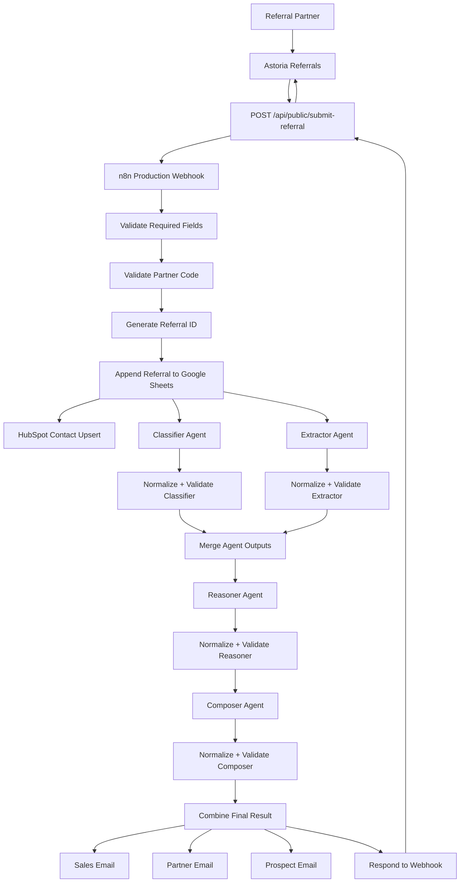

# Technical Handoff — Astoria Referrals

**Purpose:** Give the next engineer enough context to understand, run, troubleshoot, and extend Astoria Referrals without having to reverse-engineer the project first.

This document focuses on the project-specific decisions that matter. It assumes you can read TypeScript and are familiar with web APIs and workflow automation.

---

## Table of Contents

1. [Project Scope](#project-scope)
2. [Architecture at a Glance](#architecture-at-a-glance)
3. [Business Objects](#business-objects)
4. [Repository Structure](#repository-structure)
5. [Quick Start](#quick-start)
6. [Referral API Endpoint](#referral-api-endpoint)
7. [Request and Response Contract](#request-and-response-contract)
8. [Frontend Referral Service](#frontend-referral-service)
9. [n8n Workflow](#n8n-workflow)
10. [AI Agent Pattern](#ai-agent-pattern)
11. [Integrations](#integrations)
12. [Environment Variables and Secrets](#environment-variables-and-secrets)
13. [Testing](#testing)
14. [Deployment](#deployment)
15. [Error Handling and Fallback Behavior](#error-handling-and-fallback-behavior)
16. [Gotchas Learned the Hard Way](#gotchas-learned-the-hard-way)
17. [Troubleshooting](#troubleshooting)
18. [Common Extension Tasks](#common-extension-tasks)
19. [Known Limitations](#known-limitations)
20. [Safe Next Steps](#safe-next-steps)

---

## Project Scope

Astoria Referrals is a partner-facing insurance referral intake and triage application.

A referral partner submits:

- Partner code
- Prospect name
- Prospect email
- Insurance intent
- Optional referral notes

The application forwards that submission through a server-side API route into an n8n workflow.

n8n then handles:

- Required-field validation
- Partner-code validation
- Referral ID generation
- Google Sheets logging
- HubSpot CRM upsert
- Multi-agent AI triage
- Output validation and fallbacks
- Sales / partner / prospect email communication
- Final response back to the application

The application displays one of three business outcomes:

- **Ready** — referral routed automatically
- **Manual review required** — workflow completed, but a human should review the referral
- **Error** — validation, connection, or upstream failure prevented normal completion

### What this project is not

Astoria does not:

- Approve insurance coverage
- Determine eligibility
- Set pricing
- Bind policies
- Guarantee certificates
- Replace a licensed professional
- Authenticate referral partners
- Assign referrals to individual employees

The AI layer is operational triage, not an insurance decision-maker.

---

## Architecture at a Glance

### Application boundary

```text
Referral Partner
       ↓
Astoria Referrals
       ↓
POST /api/public/submit-referral
       ↓
N8N_WEBHOOK_URL
       ↓
n8n Production Workflow
       ↓
Final JSON Response
       ↓
Astoria Result Screen
```

The browser never receives the production n8n webhook URL.

### End-to-end workflow



### Responsibility by system

```text
Astoria / React      → user experience
TanStack server API  → secure browser-to-n8n boundary
n8n                  → workflow orchestration
Claude               → AI triage and communication
Google Sheets        → referral / error logging
HubSpot              → prospect CRM record
Gmail                → outbound communication
GitHub               → source control and documentation
Lovable              → frontend development / hosting workflow
```

---

## Business Objects

Three concepts are easy to mix together when working on this project.

### Partner

The organization or person sending business to Astoria.

Example:

```text
Partner Name: Partner Two
Partner Code: PARTNER002
```

The current prototype assumes partners have already been onboarded and assigned a code.

The referral form does not create new partners.

### Referral

The request moving through the workflow.

Each successful referral receives a unique ID such as:

```text
REF-2026-182
```

The referral is what gets classified, routed, logged, and tracked through the workflow.

### Prospect

The person or business being referred.

Example:

```text
Daniel Rivera
daniel@example.com
Auto insurance
```

HubSpot primarily represents the **prospect** as a CRM contact.

The prospect email is used as the identifying property for the HubSpot upsert.

---

## Repository Structure

The files below matter most to the referral flow.

```text
referral-partner-app/
│
├── README.md
├── package.json
├── .env.example
├── .gitignore
│
├── src/
│   ├── routes/
│   │   ├── index.tsx
│   │   └── api/
│   │       └── public/
│   │           └── submit-referral.ts
│   │
│   ├── lib/
│   │   ├── referral.functions.ts
│   │   └── referral.functions.test.ts
│   │
│   ├── integrations/
│   │   └── supabase/
│   │
│   ├── start.ts
│   └── ...
│
├── supabase/
│   └── config.toml
│
└── docs/
    ├── screenshots/
    └── TECHNICAL_HANDOFF.md
```

### Files to know first

#### `src/routes/index.tsx`

Main referral UI.

Responsibilities include:

- Form state
- Local validation
- Loading / step state
- Error display
- Result display
- Human-readable labels such as `personal_lines` → `Personal Lines`

#### `src/lib/referral.functions.ts`

Frontend referral service.

Responsibilities include:

- Zod validation
- Calling `/api/public/submit-referral`
- Parsing backend responses
- Separating validation errors from connection errors
- Mapping the larger n8n response into the smaller shape the UI needs

#### `src/routes/api/public/submit-referral.ts`

The main server-side referral endpoint in this repository.

This is the security boundary between the browser and n8n.

#### `src/integrations/supabase/`

Lovable-generated Supabase/auth infrastructure.

Supabase is **not currently part of the referral-submission data path**.

However, generated Supabase middleware is still registered by the app. Do not delete this folder or the related middleware casually. Verify dependencies and behavior first.

#### `src/start.ts`

Registers global TanStack Start middleware, including generated Supabase auth attachment for server functions and application error / CSRF middleware.

The public referral route itself does not require a partner login.

---

## Quick Start

### Requirements

- Node.js-compatible environment
- npm
- Access to the project's public Supabase configuration
- A valid server-side `N8N_WEBHOOK_URL` if testing the full referral flow

### Install

```bash
npm install
```

### Environment

Copy:

```bash
cp .env.example .env
```

Fill in the project-specific public Supabase values.

For an end-to-end local referral test, the server runtime also needs:

```text
N8N_WEBHOOK_URL
```

Do not prefix it with `VITE_`.

Do not commit its real value.

### Start locally

```bash
npm run dev
```

### Useful checks

```bash
npm test
npm run build
npm run lint
```

If needed, TypeScript can also be checked directly:

```bash
npx tsc --noEmit
```

---

## Referral API Endpoint

The referral API is:

```text
POST /api/public/submit-referral
```

Source:

```text
src/routes/api/public/submit-referral.ts
```

It performs four important jobs.

### 1. Parse and validate the request

The server validates the request even though the frontend already validates it.

That is intentional.

A public server endpoint should never assume the browser performed validation correctly.

### 2. Read the private n8n webhook URL

```ts
process.env["N8N_WEBHOOK_URL"]
```

The production webhook is never hardcoded into browser code.

### 3. Forward the request to n8n

The server sends a JSON POST request and waits for the complete workflow response.

### 4. Normalize upstream failures

The route:

- Preserves normal 4xx validation responses from n8n
- Converts upstream 5xx failures into a friendly `502`
- Returns `502` when n8n cannot be reached
- Returns `502` when n8n responds with malformed / non-JSON output
- Returns the full successful JSON payload with HTTP 200

### CORS

The route currently allows:

```text
Access-Control-Allow-Origin: *
```

and handles `OPTIONS` preflight requests.

That is appropriate for the current public prototype.

For a production system with authenticated partners, restrict allowed origins.

---

## Request and Response Contract

### Browser → server request

The frontend `ReferralInput` model uses:

```ts
{
  partner_code: string;
  prospect_name: string;
  prospect_email: string;
  insurance_intent: string;
  referral_notes?: string;
}
```

Before sending to the server, `insurance_intent` is mapped to the backend field:

```text
intent
```

Actual request:

```json
{
  "partner_code": "PARTNER002",
  "prospect_name": "Daniel Rivera",
  "prospect_email": "daniel@example.com",
  "intent": "auto insurance",
  "referral_notes": "I just bought a 2024 Honda Accord and need coverage before Friday."
}
```

### Successful n8n response

The full n8n response contains more information than the UI displays.

Example shape:

```json
{
  "referral_id": "REF-2026-182",
  "processing_status": "ready",
  "referral": {
    "partner_code": "PARTNER002",
    "prospect_name": "Daniel Rivera",
    "prospect_email": "daniel@example.com",
    "intent": "auto insurance"
  },
  "final_decision": {
    "insurance_line": "auto",
    "urgency": "high",
    "priority": "high",
    "route_to": "personal_lines",
    "sla_hours": 4,
    "next_action": "Contact the prospect and begin the quoting process.",
    "needs_human_review": false
  },
  "extracted_facts": {},
  "communications": {},
  "trace": {},
  "fallbacks_used": []
}
```

### UI response model

`referral.functions.ts` intentionally maps that large response into:

```ts
type ReferralResult = {
  referral_id: string;
  insurance_line: string;
  urgency: string;
  priority: "high" | "medium" | "low";
  route_to: string;
  sla_hours: number;
  next_action: string;
  processing_status: "ready" | "manual_review_required";
};
```

The public UI does not need internal traces, agent confidence values, fallback internals, or generated emails.

### Important mapping behavior

The frontend currently treats:

```text
processing_status === "manual_review_required"
```

as manual review.

Any other successful value falls back to:

```text
ready
```

If new processing states are added later, update this mapping explicitly rather than relying on that default.

---

## Frontend Referral Service

Source:

```text
src/lib/referral.functions.ts
```

The frontend service performs three layers of protection.

### Zod validation

Required fields:

- `partner_code`
- `prospect_name`
- `prospect_email`
- `insurance_intent`

`referral_notes` is optional.

### Network handling

If the browser cannot reach the server endpoint, it returns:

```text
kind: "connection"
```

with a user-friendly message.

### Response mapping

Successful n8n output is converted into only the fields needed by the UI.

This gives the frontend a stable contract even though the internal workflow response is much larger.

---

## n8n Workflow

The production workflow lives in n8n, not in this GitHub repository.

That makes n8n a **critical external dependency**.

Anyone taking ownership of this project needs access to:

- The active production workflow
- Its credentials
- Google Sheets
- HubSpot
- Gmail
- Anthropic / Claude

If the workflow is exported into source control later, sanitize all credential references and private URLs first.

### High-level workflow

```text
Webhook
  ↓
Validate Required Fields
  ↓
Validate Partner Code
  ↓
Generate Referral ID
  ↓
Append Referral to Google Sheets
  ├── HubSpot Contact Upsert
  ├── Classifier Agent
  └── Extractor Agent
          ↓
    Merge Agent Outputs
          ↓
      Reasoner Agent
          ↓
      Composer Agent
          ↓
    Combine Final Result
      ├── Sales Email
      ├── Partner Email
      ├── Prospect Email
      └── Respond to Webhook
```

### Error paths

Missing required fields return an HTTP 400 response.

Invalid partner codes return an HTTP 400 response.

HubSpot has its own integration error handling / logging path.

Agent failures do not automatically fail the HTTP request. They can become safe fallback results that trigger human review.

---

## AI Agent Pattern

There are four current agents.

### Classifier

Responsibility:

```text
What insurance line is this, and how urgent is it?
```

Outputs include:

- insurance line
- urgency
- confidence
- human-review flag
- agent version

### Extractor

Responsibility:

```text
What facts were explicitly provided?
```

Outputs include:

- business type
- employee count
- requested coverages
- deadline
- stated constraints
- additional facts
- confidence
- human-review flag

It should not invent missing details.

### Reasoner

Responsibility:

```text
What operational action should the sales team take?
```

Outputs include:

- priority
- routing team
- SLA
- next action
- reason
- confidence
- human-review flag

Current SLA rule:

```text
High   → 4 hours
Medium → 24 hours
Low    → 72 hours
```

### Composer

Responsibility:

```text
How should the validated result be communicated?
```

Produces:

- Sales summary
- Partner email subject / body
- Prospect email subject / body

The Composer does not get authority to change routing or make insurance decisions.

---

## Agent Validation Pattern

Each agent follows the same general pattern:

```text
Claude HTTP Request
       ↓
Success / Error Output
       ↓
Normalize <Agent> Result
       ↓
Validate Schema
       ↓
Valid Output OR Safe Fallback
```

### Important implementation detail

Claude can return multiple content blocks.

A response may contain a `thinking` block before the actual `text` block.

Do **not** assume:

```js
$json.content?.[0]?.text
```

Instead locate the text block:

```js
const textBlock = $json.content?.find(item => item.type === "text");
let raw = textBlock?.text;
```

This issue caused a real Extractor failure during development.

### Why the normalizers matter

A successful API call only proves Claude returned something.

It does **not** prove the output:

- Is JSON
- Matches the required schema
- Includes every required field
- Is safe to use downstream

The normalizer therefore:

1. Detects API errors
2. Finds the actual text output
3. Removes markdown fences when necessary
4. Parses JSON
5. Validates every required field and type
6. Returns a safe fallback if any step fails

### Adding another agent

Reuse this pattern unless the new agent has different requirements.

Do not wire raw LLM output directly into downstream business logic.

---

## Integrations

### Google Sheets

Purpose:

```text
Referral log / audit trail
```

The workflow appends referral information before the AI triage continues.

This provides a simple operational record of submissions.

If the Google credential loses access, the workflow can fail early at the append-row node.

### HubSpot

Purpose:

```text
Prospect CRM record
```

The workflow uses the prospect email as the identifying property for contact upsert behavior.

Expected behavior:

```text
New email      → create contact
Existing email → update/upsert existing contact
```

HubSpot is representing the **prospect**, not the referral partner.

### Gmail

Purpose:

- Internal sales notification
- Partner confirmation / update
- Prospect communication

All three Gmail branches receive the combined workflow result directly.

Do not chain business logic after a Gmail send node unless you intentionally reference earlier nodes by name. Gmail nodes can replace `$json` with the send operation response.

### Anthropic / Claude

Purpose:

- Classification
- Fact extraction
- Operational reasoning
- Communication composition

Credentials remain inside n8n.

No Anthropic key belongs in the public application repository.

---

## Environment Variables and Secrets

### Public / frontend-safe configuration

`.env.example` contains safe Supabase project configuration placeholders.

Public Supabase publishable values may be present in frontend configuration.

### Private server variable

The referral server requires:

```text
N8N_WEBHOOK_URL
```

Recommended `.env.example` documentation:

```env
# Supabase / Lovable Cloud public configuration
SUPABASE_PROJECT_ID=your_supabase_project_id
SUPABASE_PUBLISHABLE_KEY=your_supabase_publishable_key
SUPABASE_URL=your_supabase_url
VITE_SUPABASE_PROJECT_ID=your_supabase_project_id
VITE_SUPABASE_PUBLISHABLE_KEY=your_supabase_publishable_key
VITE_SUPABASE_URL=your_supabase_url

# Server-only referral routing secret.
# Use a real value only in a private local/server runtime.
# Never commit the production webhook or expose it through VITE_ variables.
N8N_WEBHOOK_URL=your_n8n_production_webhook_url
```

### Never commit

- Production n8n webhook URL
- Anthropic API keys
- HubSpot private tokens
- Gmail OAuth secrets / tokens
- Supabase service-role keys
- Passwords
- Private credentials of any kind

The real `.env` and `.env.*` files should remain ignored.

---

## Testing

M5 added a small Vitest suite around the referral service.

Source:

```text
src/lib/referral.functions.test.ts
```

The tests are intentionally focused rather than broad.

Current coverage includes:

1. Required partner-code validation
2. Invalid prospect email validation
3. Successful n8n response mapping
4. `manual_review_required` response mapping
5. Network / connection failure handling

All network behavior is mocked.

The tests must **not**:

- Send real emails
- Create real HubSpot contacts
- Add real Google Sheet rows
- Call the production n8n webhook

### Run once

```bash
npm test
```

### Watch mode

```bash
npm run test:watch
```

### Build check

```bash
npm run build
```

### Production smoke test

Automated tests do not replace the end-to-end production audit.

The live system has also been manually verified for:

- Happy path
- Manual-review path
- Invalid partner error
- Mobile usability
- Browser console errors
- Google Sheets logging
- HubSpot CRM
- Email delivery

---

## Deployment

### Frontend / application

The live application is hosted through Lovable:

```text
https://astoria-referrals.lovable.app
```

The GitHub repository is connected to the Lovable project.

Changes made through Lovable sync into the repository.

### n8n

The application must use the n8n **Production URL**:

```text
/webhook/...
```

not the editor-only test URL:

```text
/webhook-test/...
```

The n8n workflow must be published / active for the production webhook to remain registered.

### Deployment smoke test

After any backend or workflow change:

1. Open the public Astoria URL
2. Submit one known-good referral
3. Confirm a successful result
4. Confirm the corresponding n8n execution is green
5. Confirm the Sheet row
6. Confirm HubSpot
7. Confirm expected emails
8. Check the browser console

Do not rely only on an n8n node-level test.

---

## Error Handling and Fallback Behavior

There are two different categories of failure in this system.

### Application / transport failure

Examples:

- Server cannot reach n8n
- n8n returns 5xx
- n8n sends malformed JSON
- Server-side secret is missing

Expected user-facing result:

```text
Connection / routing service error
```

### Business / validation failure

Examples:

- Missing required field
- Invalid email
- Invalid partner code

Expected result:

```text
400-level validation error
```

The user's form data remains available so they can correct the issue.

### Agent failure

This is different.

If an agent:

- Returns invalid JSON
- Omits required fields
- Hits an API error
- Fails schema validation

the workflow can still complete using a safe fallback.

The final result may become:

```text
processing_status: manual_review_required
```

That is a **successful workflow outcome**, not necessarily an HTTP error.

### Manual review

Manual review should be treated as a first-class business state.

Do not turn it into a red error screen.

It means:

```text
The automation finished,
but the referral needs a human decision.
```

---

## Gotchas Learned the Hard Way

These are here because they cost real debugging time.

### 1. Save the n8n workflow before testing it externally

Node-level execution and a real webhook request are not always testing the exact same saved state.

Before testing through the live app or an API client:

```text
Save / publish the workflow first.
```

### 2. Production webhook vs test webhook

The test URL:

```text
/webhook-test/...
```

is temporary and editor-dependent.

The app must use:

```text
/webhook/...
```

with the workflow active.

### 3. Claude content blocks

Do not assume the first content block contains text.

Find:

```js
item.type === "text"
```

before parsing the response.

### 4. n8n expression syntax

In exported workflow JSON, expressions are commonly represented with a leading `=`.

Inside the n8n editor, switch the field into **Expression** mode and verify that the preview evaluates correctly.

Do not rely only on how the raw exported value looks.

### 5. Gmail nodes overwrite `$json`

If another node comes after a Gmail send, `$json` may contain Gmail's response instead of the referral result.

For this reason, Sales / Partner / Prospect email nodes branch directly from `Combine Final Result`.

### 6. Google Sheets permissions can break an otherwise healthy workflow

A recent live deployment failure came from:

```text
Append row in sheet → Forbidden
```

The application and webhook were healthy.

The Google Sheets credential / document access was the problem.

When the app reports a generic upstream failure, inspect the actual n8n execution before changing frontend code.

### 7. Multi-line JSON in n8n can be fragile

When a JSON field produces a cryptic parse error:

- Check Expression mode
- Check quotation marks
- Check pasted characters
- Check whether the value is expected to be JSON vs a string

Do not immediately assume the API credential is wrong.

### 8. A green API node is not the end of validation

The system needs both:

```text
API success
AND
schema-valid output
```

That distinction is central to the agent architecture.

---

## Troubleshooting

| Symptom | First place to check | Likely cause |
|---|---|---|
| App says it cannot reach routing service | Latest n8n execution | Workflow node failed or n8n unreachable |
| `"webhook is not registered"` | n8n Webhook node | Test URL used or workflow not active |
| `Append row in sheet: Forbidden` | Google Sheets credential + document sharing | Expired credential / missing Editor permission |
| Invalid partner code | Partner validation logic in n8n | Code not onboarded / typo |
| HubSpot contact missing | HubSpot branch in execution | Credential, mapping, API failure |
| Duplicate CRM behavior | HubSpot upsert configuration | Email not being used consistently as id property |
| Emails missing | Gmail branch + Composer output | Gmail credential / invalid generated email object |
| Referral becomes manual review unexpectedly | `trace` and `fallbacks_used` | One agent fell back or confidence was too low |
| Extractor shows `missing_output` | Extractor normalizer | Text-block parsing regression |
| App receives only `{"status":"received"}` | Success Respond-to-Webhook node | Response node moved too early in workflow |
| Browser shows old UI after change | Lovable deployment / cache | Latest version not published yet |
| UI displays raw `personal_lines` | `humanize()` in `index.tsx` | New backend value missing from display mapping |

---

## Common Extension Tasks

### Add a new partner

Current partner management is hardcoded in the workflow.

A new partner may require updates in more than one place, including:

- Partner-code validation
- Partner name lookup
- Partner email mapping

Before real scale, move these values into one Partner Directory instead of continuing to duplicate mappings in n8n.

### Add a fifth AI agent

Recommended process:

1. Define one narrow responsibility
2. Define the exact input
3. Define a structured output schema
4. Create the Claude HTTP Request
5. Send both success and error outputs into one normalizer
6. Parse the `text` content block
7. Validate every required field
8. Add a safe fallback
9. Pass only the normalized result downstream
10. Update the final trace / Combiner contract if needed

### Add Slack or Teams notifications

Branch from:

```text
Combine Final Result
```

rather than after a Gmail node.

Use the combined object as the stable source of truth.

### Move referral logging off Google Sheets

The AI architecture does not depend on Sheets.

Replace the persistence node with a database write while keeping the referral object contract stable.

### Improve HubSpot

Potential additions:

- Deal creation
- Referral source property
- Pipeline stage
- Owner assignment
- Conversion status
- Partner relationship records

Keep prospect/contact identity separate from the referral itself.

### Add partner authentication

Do not treat partner codes as passwords.

A real authentication layer should separately answer:

```text
Who is signed in?
```

while the partner record answers:

```text
Which referral partner does this submission belong to?
```

---

## Known Limitations

### Partner management

Partners are currently predefined in workflow logic.

There is no central Partner Directory or onboarding screen.

### Authentication

The referral flow is public.

A valid partner code identifies the source but does not securely authenticate the user.

### Health indicator

Do not represent a static UI badge as real infrastructure monitoring.

If the product needs a true `System Online` state, add a real health check.

### CRM

HubSpot currently focuses on prospect contact upsert.

There is not yet a complete referral/deal pipeline.

### Assignment

Routing is team-level.

There is no individual sales-owner assignment.

### Observability

There is no dedicated monitoring dashboard for:

- Workflow failure rate
- Agent fallback rate
- Human-review rate
- API latency
- CRM failures
- Email failures

### Automated tests

The current suite covers the core frontend referral service.

It is not yet full browser, server-route, or n8n end-to-end automation.

### External workflow dependency

The production n8n workflow is not stored in this frontend repository.

A complete organizational handoff must include either:

- access to the n8n workspace, or
- a sanitized workflow export with setup instructions

---

## Safe Next Steps

These are the highest-value extensions without rewriting the product.

### 1. Central Partner Directory

```text
Partner Code
Partner Name
Partner Email
Status
Created Date
```

Use that one source for validation and communication.

### 2. Partner onboarding

```text
Create Partner
→ Generate Code
→ Store Partner
→ Send Welcome Information
→ Activate
```

### 3. Authentication

Add partner accounts and permissions.

### 4. CRM pipeline

Track:

```text
Referral Submitted
→ Contacted
→ Quoted
→ Won / Lost
```

### 5. Observability

Add operational monitoring before adding more AI complexity.

Useful metrics:

- Successful referral rate
- Average processing time
- Fallback rate by agent
- Manual-review percentage
- CRM integration failures
- Email delivery failures

### 6. Broader automated testing

Add:

- Server-route tests
- UI component tests
- Browser end-to-end tests
- Contract tests for n8n response shape

### 7. Version the workflow

Store a sanitized n8n export alongside the application so code and workflow changes can be reviewed together.

Do not include credentials or private webhook URLs.

---

## Final Handoff Notes

The most important design choice in Astoria is the separation of responsibilities.

```text
Frontend    → collect and explain
Server API  → protect the backend boundary
n8n         → orchestrate
Agents      → perform narrow reasoning tasks
Normalizers → validate AI output
HubSpot     → represent the prospect
Sheets      → keep the referral record
Gmail       → communicate
Human       → take over when confidence is not good enough
```

When extending the system, keep those boundaries clear.

The easiest way to make this project harder to maintain would be to start giving one layer responsibilities that belong to another.

The goal is not the most complicated architecture.

The goal is a system where the next person can answer:

> **What happened, why did it happen, and where do I change it?**

If those three questions stay easy to answer, the project is moving in the right direction.
